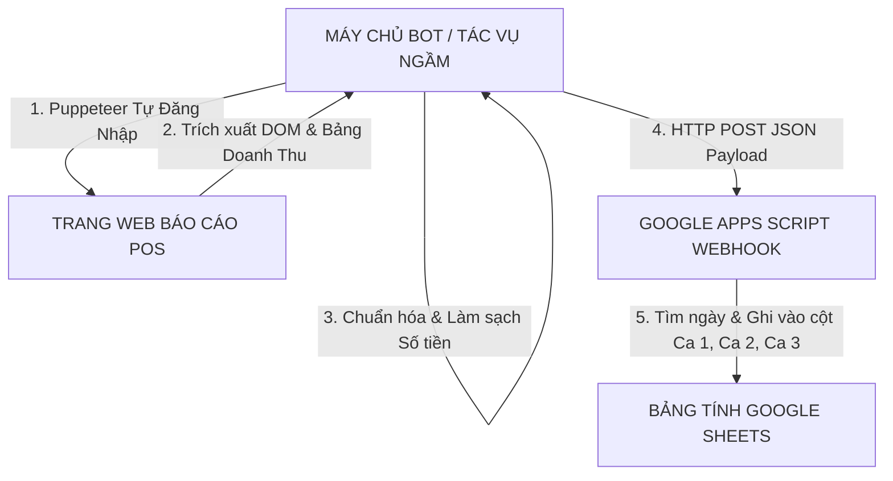

# Hệ Thống Bot Tự Động Cào Dữ Liệu POS & Đồng Bộ Google Sheets

Hệ thống tự động hóa hoàn toàn chạy ngầm được xây dựng bằng **Node.js + Puppeteer** kết hợp với **Google Apps Script Webhook**. Bot sẽ định kỳ tự động đăng nhập vào giao diện web POS của nhà hàng/cửa hàng, đọc bảng báo cáo đóng ca (Thời gian mở ca, thời gian đóng ca, doanh thu net), làm sạch dữ liệu và đẩy sang Google Sheets để tự động điền vào các ô **Ca 1**, **Ca 2**, **Ca 3** tương ứng với ngày trong tháng.

---

## 📐 Kiến Trúc Hệ Thống



---

## ⚡ TỰ ĐỘNG THIẾT LẬP NHANH (AUTOMATED SETUP WIZARD)

Hệ thống đã hỗ trợ sẵn **Bộ cài đặt tự động (Setup Wizard)** và **Bộ Presets CSS Selectors** cho các phần mềm POS phổ biến nhất tại Việt Nam (**KiotViet, Sapo, POS365, iPOS/FABi, CukCuk**):

Chỉ cần mở Terminal tại thư mục dự án và gõ lệnh:
```bash
npm run setup
```
Công cụ sẽ tự động:
1. Cho bạn chọn loại phần mềm POS đang dùng (KiotViet, Sapo, POS365, iPOS, CukCuk hoặc Tùy chỉnh).
2. Hướng dẫn nhập đường dẫn trang Web POS, Tài khoản/Mật khẩu và Webhook Google Apps Script.
3. Tự động sinh file `.env` với các bộ Selector CSS chuẩn xác nhất.
4. **Tự động đăng ký tác vụ ngầm `POSRevenueSyncBot` vào Windows Task Scheduler** để máy tính tự cào dữ liệu báo cáo mỗi 30 phút mà không cần mở cửa sổ dòng lệnh!

---

## 📁 Cấu Trúc Thư Mục Dự Án

```
Hệ Thống Tự Động/
├── .env.example               # File mẫu biến môi trường
├── .env                       # File cấu hình biến môi trường thực tế
├── setup.js                   # Công cụ Wizard cài đặt tự động tương tác
├── config.js                  # Module đọc và quản lý cấu hình dự án
├── config/
│   └── posPresets.js          # Bộ Presets Selectors cho KiotViet, Sapo, Pos365, iPOS, CukCuk
├── scripts/
│   └── setup-windows-task.js  # Script tự động đăng ký Windows Task Scheduler
├── index.js                   # Điểm khởi chạy chính (Hỗ trợ chạy ngầm Cron & Chạy 1 lần --once)
├── package.json               # Quản lý dependencies (puppeteer, axios, node-cron, winston, ...)
├── README.md                  # Hướng dẫn sử dụng & triển khai
├── google-apps-script/
│   └── Code.gs                # mã nguồn Google Apps Script (Webhook doPost/doGet)
├── mock/
│   └── mockPosServer.js       # Máy chủ POS giả lập dùng cho kiểm thử
├── services/
│   ├── posScraper.js          # Service điều khiển Puppeteer tự động cào báo cáo POS
│   └── sheetsSync.js          # Service gửi dữ liệu sang Google Apps Script Webhook
├── test/
│   ├── test-parser.js         # Script kiểm thử làm sạch số tiền & xác định ca
│   └── test-mock-run.js       # Script kiểm thử end-to-end với POS giả lập
└── utils/
    ├── logger.js              # Ghi log hoạt động & lỗi vào console và file (logs/)
    └── parser.js              # Bộ lọc làm sạch tiền tệ (ví dụ "374,000 đ" -> 374000)
```

---

## 🚀 Hướng Dẫn Cài Đặt & Triển Khai

### 1. Triển Khai Webhook Google Apps Script (Google Sheets)

1. Mở trang bảng tính Google Sheets của bạn.
2. Tạo/Đặt tên trang tính là: **`Doanh Thu Ca`**.
3. Đặt hàng tiêu đề đầu tiên (Hàng 1) như sau:
   | A | B | C | D | E | F |
   |---|---|---|---|---|---|
   | **Ngày** | **Ca 1** | **Ca 2** | **Ca 3** | **Tổng Doanh Thu** | **Cập Nhật Sau Cùng** |
4. Vào menu **Tiện ích mở rộng (Extensions)** > **Apps Script**.
5. Mở file [google-apps-script/Code.gs](file:///c:/Users/ASUS/OneDrive/T%C3%A0i%20li%E1%BB%87u/H%E1%BB%87%20Th%E1%BB%91ng%20T%E1%BB%B1%20%C4%90%E1%BB%99ng/google-apps-script/Code.gs) trong dự án này, copy toàn bộ mã nguồn và dán vào cửa sổ Apps Script.
6. Nhấn nút **Triển khai (Deploy)** > **Triển khai dưới dạng ứng dụng web (New deployment)**.
   - **Thực thi dưới tên:** `Tôi` (Me)
   - **Quyền truy cập:** `Bất kỳ ai` (Anyone)
7. Nhấn **Triển khai**, cấp quyền và **SAO CHÉP URL WEB APP** (Có dạng: `https://script.google.com/macros/s/AKfycb.../exec`).

---

### 2. Cấu Hình Biến Môi Trường (`.env`)

Tạo hoặc chỉnh sửa file `.env` tại thư mục gốc của dự án với thông tin của bạn:

```env
# URL Webhook Google Apps Script nhận được ở Bước 1
GAS_WEBHOOK_URL=https://script.google.com/macros/s/YOUR_SCRIPT_ID/exec

# Cấu hình Tài khoản & URL Báo cáo POS của bạn
POS_LOGIN_URL=https://pos-cua-ban.com/login
POS_USERNAME=admin_thu_ngan
POS_PASSWORD=mat_khau_cua_ban
POS_REPORT_URL=https://pos-cua-ban.com/reports/shift-closing

# Cấu hình Chạy Bot
HEADLESS=true
CRON_SCHEDULE=0,30 * * * *

# CSS Selectors nhắm vào thẻ HTML của POS (Tùy chỉnh theo HTML của POS bạn dùng)
POS_SELECTOR_USERNAME_INPUT=#username
POS_SELECTOR_PASSWORD_INPUT=#password
POS_SELECTOR_LOGIN_BTN=button[type="submit"]
POS_SELECTOR_REPORT_TABLE=table.shift-report-table
POS_SELECTOR_ROW=table.shift-report-table tbody tr
POS_SELECTOR_OPEN_TIME=td.open-time
POS_SELECTOR_CLOSE_TIME=td.close-time
POS_SELECTOR_NET_REVENUE=td.net-revenue
POS_SELECTOR_SHIFT_NAME=td.shift-name
```

---

## 🧪 Hướng Dẫn Kiểm Thử (Testing)

Dự án đi kèm máy chủ POS giả lập để bạn thử nghiệm ngay lập tức mà chưa cần cấu hình POS thật:

1. **Kiểm tra bộ lọc tiền tệ:**
   ```bash
   npm run test:parser
   ```
2. **Chạy thử nghiệm End-to-End với POS Giả lập:**
   ```bash
   npm run test:mock
   ```

---

## ⚙️ Hướng Dẫn Vận Hành Hệ Thống

### Chế độ 1: Chạy trực tiếp 1 lần (Cho Windows Task Scheduler / Cron job)
```bash
npm run once
# Hoặc: node index.js --once
```

### Chế độ 2: Chạy liên tục ngầm theo lịch Cron (Daemon Service)
```bash
npm start
# Hoặc: node index.js
```

### Triển khai Chạy Ngầm Nâng Cao:
- **Bằng PM2 (Khuyên dùng trên Server/PC):**
  ```bash
  npm install -g pm2
  pm2 start index.js --name "pos-revenue-bot"
  pm2 save
  ```
- **Bằng Windows Task Scheduler:**
  - Tạo một **Basic Task** trong Windows Task Scheduler.
  - Chọn Action: `Start a program`.
  - Program/script: `node`
  - Add arguments: `c:\Users\ASUS\OneDrive\Tài liệu\Hệ Thống Tự Động\index.js --once`
  - Đặt lịch lặp lại mỗi 30 phút.
